# Comprendre My Climbing List

**Édition illustrée — 13 septembre 2026**

Guide pédagogique destiné aux étudiants qui découvrent et reprennent MCL.

[Version PDF — 15 pages](MCL_COMPRENDRE.pdf) · [Version Word modifiable](MCL_COMPRENDRE.docx)

Pour installer et lancer l'application, suivre [Démarrer My Climbing List en local](MCL_DEMARRAGE_LOCAL.md). Ce document explique ensuite ce que l'on observe, les données qui le rendent possible et les décisions à discuter pour une reprise.

Trois repères accompagnent la lecture : **POC** décrit le fonctionnement documenté de l'application ; **démo étudiante** désigne le livrable fictif disponible ; **refonte proposée** présente une évolution à valider. Une règle observée dans le code peut contenir un défaut : sa présence ne suffit pas à justifier sa conservation.

## 1. Pourquoi My Climbing List existe

Une salle renouvelle ses voies et ses blocs. Pour le grimpeur, ce renouvellement crée de nouvelles envies, mais rend aussi difficile la mémorisation des essais et des réussites. Quelle voie ai-je déjà essayée ? Laquelle ai-je réussie ? Quel objectif ai-je laissé en cours ? Que devient mon historique lorsque les prises sont démontées ?

My Climbing List est un POC développé pour Altissimo qui relie le catalogue de la salle à un carnet personnel. Le topo aide à choisir une ouverture ; la saisie conserve une trace de la pratique ; le carnet, les projets et les graphiques permettent de relire cette expérience.

Le parcours central peut se lire ainsi :

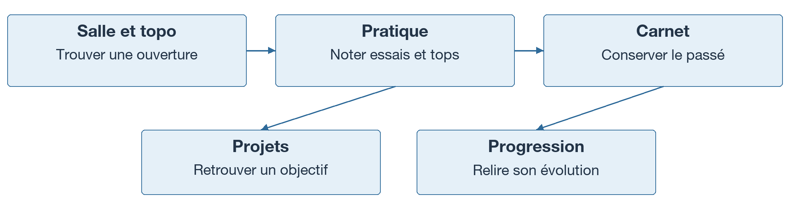

MCL contient aussi des outils pour le staff, la direction et les compétitions. Tous reposent, à des degrés différents, sur des lieux, des ouvertures, des personnes et des performances. Ils ne se réduisent pourtant pas au carnet : certains événements ont leurs propres participants et leurs propres résultats.

Le besoin général est décrit dans la passation. En revanche, les documents ne permettent pas de mesurer l'usage réel de chaque fonction, ni de reconstituer les raisons de tous les choix historiques. La reprise devra compléter cette connaissance par une validation métier.

**À retenir :** le catalogue représente ce qui peut être grimpé ; le carnet conserve ce qui a été pratiqué.

*Source : notice de reprise, sections 1 et 2.*

## 2. Découvrir le produit dans la démo étudiante

La copie étudiante permet d'étudier MCL sans accéder à la production. Sa base initiale contient deux comptes, trois salles fictives — Démo Voie, Démo Bloc et Démo Mixte —, dix-huit ouvertures et dix-neuf lignes de pratique. Elle comprend notamment une ouverture inactive et des plans SVG synthétiques.

Le compte de référence est `demo.climb`. Les modalités de connexion figurent dans le guide local. Les modifications réalisées dans cet environnement sont conservées lors des redémarrages ; une remise à zéro explicite restaure la démo.

| Public | Ce qu'il cherche à faire dans MCL |
|---|---|
| Grimpeur | Trouver une ouverture, noter sa pratique et retrouver son historique |
| Grimpeur accompagné | Partager sa pratique avec des salles autorisées |
| Staff | Observer les ouvertures, suivre des grimpeurs et organiser des compétitions |
| Direction | Consulter des indicateurs d'utilisation à l'échelle du réseau |
| Participant à une compétition | S'inscrire, déclarer une performance et consulter un classement |

Le parcours préparé concerne principalement le grimpeur : salles, topo, plan, saisie, carnet, historique et projets. Staff et Direction n'ont pas de parcours de démonstration préparé ; Contest n'a pas de démonstration complète. Les calculs Elo ne sont pas exécutés automatiquement au démarrage. Il faut donc distinguer une fonction présente dans le code d'une fonction immédiatement démontrable.

*Sources : guide local, sections 5 à 7 et 12 ; validation du livrable.*

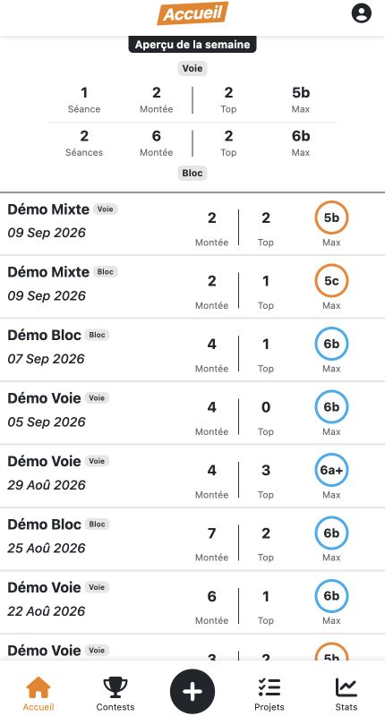

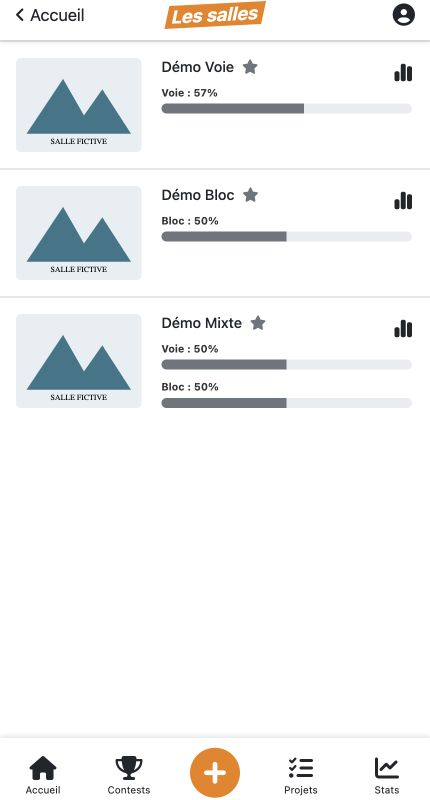

Accueil et salles fictives. Le bouton + ouvre le choix de salle. Les pourcentages appartiennent à la démo.

## 3. Lire une salle et son topo

Une **ouverture** est un tracé installé par un ouvreur. Elle peut être une voie ou un bloc. Le mot ne désigne donc pas les horaires d'accès à la salle. Le **topo** présente les ouvertures du catalogue courant, sous forme de liste ou de plan.

Une voie se pratique avec une corde, en moulinette ou en tête. Le bloc se pratique sans corde. Dans le modèle actuel, un même champ numérique, `relais`, sert à situer les voies et les blocs : emplacement de voie dans un cas, secteur de bloc dans l'autre. Il n'existe pas d'entité autonome pour cet emplacement.

| Propriété | Ce qu'elle décrit |
|---|---|
| Cotation | La difficulté annoncée, par exemple 6a ou 6a+ |
| Couleur des prises | Un moyen de reconnaître le tracé |
| Couleur de cotation | Un repère visuel lié au niveau, distinct des prises |
| Profil | La géométrie du mur, par exemple dalle ou dévers |
| Style | Le caractère des mouvements, par exemple technique ou résistance |
| Ouvreur et date | Des informations sur la création du tracé |
| État actif | La présence de l'ouverture dans le catalogue courant |

Deux ouvertures peuvent utiliser le même emplacement à des moments différents. Leur identité ne peut donc pas être déduite du seul numéro de relais, de leur couleur ou de leur nom. Cette distinction est fondamentale pour conserver le bon historique après renouvellement.

Certaines salles peuvent masquer temporairement les cotations récentes. Le POC possède une règle autour de sept jours ; ses bornes exactes doivent être validées avant d'en faire une règle du futur produit.

*Sources : notice, sections 3, 4 et 5 « Topo » ; règles R06, R07 et R23.*

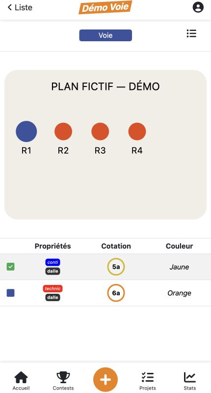

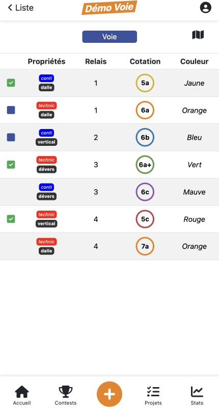

Démo Voie : extraits du plan et de la liste. Cotation cerclée, couleur des prises et propriétés décrivent des informations distinctes.

## 4. Enregistrer sa pratique

MCL recueille des compteurs. Un **essai** est une tentative, réussie ou non. Un **top** est une réussite et fait partie des essais. Le nombre d'échecs se déduit de leur différence.

| Exemple pédagogique | Essais | Tops | Échecs |
|---|---:|---:|---:|
| Trois essais dont une réussite | 3 | 1 | 2 |
| Deux essais sans réussite | 2 | 0 | 2 |
| Une réussite au premier essai | 1 | 1 | 0 |

Pour une voie, les compteurs distinguent moulinette et tête. La moulinette utilise une corde déjà en place en haut ; en tête, le grimpeur clippe la corde pendant sa progression. La saisie en tête dépend de la configuration des relais de la salle. Le bloc utilise les compteurs génériques et ne doit pas recevoir un canal tête.

Le **flash** désigne une réussite au premier essai. Sa traduction informatique mérite davantage de précision : un essai antérieur en moulinette empêche-t-il un flash en tête ? Que devient une déclaration de flash après correction d'une ancienne pratique ? Les documents identifient ces questions sans les trancher.

Dans le POC, le navigateur ajuste les compteurs et prépare la saisie. Les rapports signalent que le serveur n'impose pas tous les mêmes contrôles. La cible doit garantir des entiers non négatifs et des tops inférieurs ou égaux aux essais, même lorsqu'une demande ne vient pas du formulaire habituel.

*Sources : notice, section 5 « Saisie d'une séance » et règles R01–R03.*

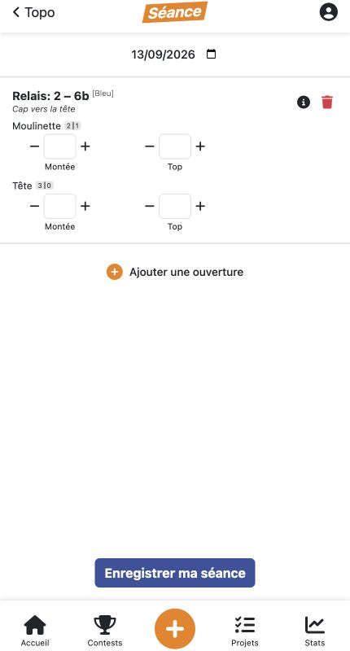

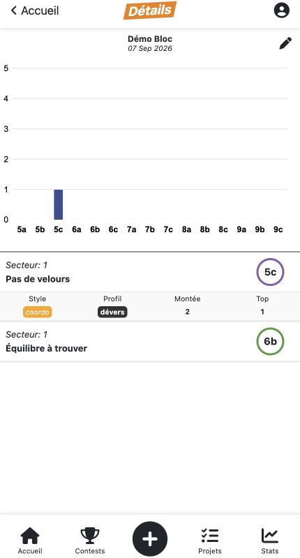

À gauche, les canaux moulinette et tête du formulaire. À droite, détail d’une pratique de bloc, avec un seul couple montée et top. Aucun enregistrement nouveau pour ces captures.

## 5. Comprendre ce que le carnet conserve

Dans la vie du grimpeur, une séance correspond à une visite ou à une période de pratique. Dans le modèle Django actuel, une ligne `Seance` relie un utilisateur, une ouverture et une date, avec des compteurs. Ce sont deux échelles différentes.

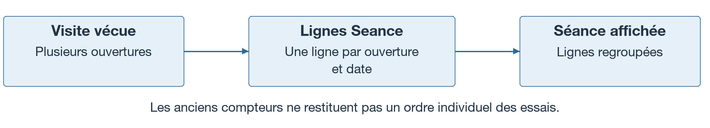

Le journal permet de relire des journées de pratique. Le carnet des réalisations agrège les données par ouverture : il conserve notamment une première date de réussite et cumule des compteurs. Une ouverture répétée plusieurs fois peut donc produire plusieurs lignes de pratique tout en représentant une seule ouverture réussie.

Ce modèle ne conserve pas une liste ordonnée des tentatives. Il ne permet pas non plus de distinguer toutes les visites d'une même journée à partir des regroupements actuels. Lors d'une migration, il faudra conserver les compteurs disponibles sans inventer les horaires ou l'ordre des essais.

Une ouverture démontée peut rester dans le carnet : son inactivité ne signifie pas que la pratique a disparu. En revanche, les suppressions physiques en cascade peuvent effacer des références historiques. Préserver le carnet exige donc une politique explicite de retrait du catalogue.

Autre subtilité : le filtre combinant flash et tête peut trouver un flash et un top tête sur des réalisations différentes. Cela ne prouve pas qu'une réalisation unique a été faite flash en tête.

*Sources : notice, sections 4 et 5 « Carnet » ; modèle `core/models/seance.py` relu pour cette version.*

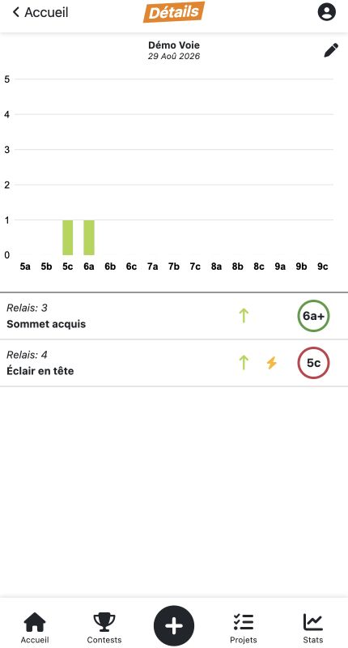

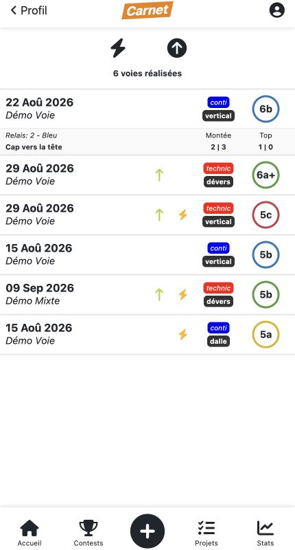

Une séance regroupe des pratiques datées ; le carnet agrège les réalisations par ouverture. « Cap vers la tête » affiche séparément les deux modes.

## 6. Pourquoi une voie réussie peut rester en projet

Un projet représente un objectif encore à atteindre. Le POC le calcule depuis la pratique ; il ne possède pas une fiche Projet indépendante.

Pour une voie dont le relais permet la tête, une réussite en moulinette peut suffire à afficher une réussite dans le topo, tout en laissant l'objectif tête ouvert. Le premier top en tête termine cet objectif.

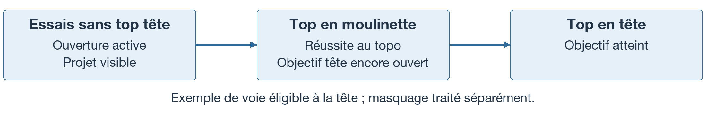

Hors de ce cas, une réussite générique termine le projet selon la règle documentée. La liste retient les ouvertures actives, avec des essais et une visibilité déterminée par la dernière ligne de pratique. Certaines cotations sont également exclues par le filtrage actuel.

Masquer un projet modifie les lignes existantes. Une nouvelle pratique à une date ultérieure peut le faire réapparaître. Ce comportement doit être présenté comme une particularité du POC, puis soumis à une décision : le masquage doit-il durer jusqu'à une action explicite du grimpeur ?

Les rapports signalent aussi un test de relais qui n'exclut pas explicitement le bloc dans le calcul des projets. Une collision entre numéros de secteur et relais ne doit pas devenir un objectif tête sur un bloc.

*Sources : notice, section 5 « Projets » et règles R04–R05.*

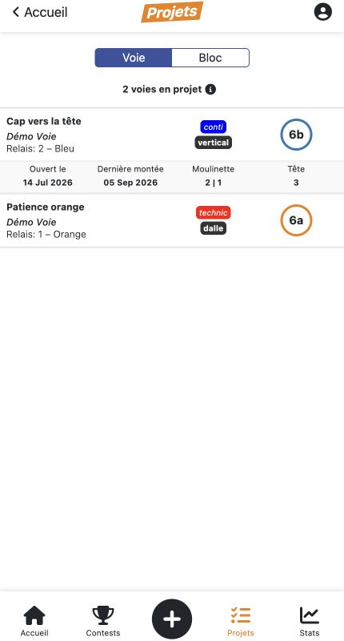

« Cap vers la tête » reste en projet malgré un top en moulinette. Les informations affichées proviennent de l’historique fictif.

## 7. Lire les statistiques et la progression

Les graphiques répondent à des questions différentes. Le volume mesure combien de tentatives ou de réussites ont été enregistrées. La diversité mesure combien d'ouvertures différentes ont été réussies. Le niveau estime une capacité sportive à partir d'un calcul.

Exemple pédagogique : réussir cinq fois la même ouverture représente cinq tops, mais une seule ouverture distincte réussie. Le graphe d'ascensions du POC privilégie cette deuxième lecture. Il donne priorité à la tête lorsque les deux modes sont réussis, regroupe les cotations avec « + » avec leur cotation de base et exclut les niveaux inférieurs à 5. Ces conventions doivent accompagner son interprétation.

Le niveau repose sur un Elo adapté, séparé pour la voie et le bloc. Le moteur documenté commence son estimation après douze lignes de pratique avec réussite : ce ne sont pas nécessairement douze ouvertures distinctes. Il compare difficulté et niveau estimé, pondère les réussites flash ou en tête et limite certaines pénalités d'échec.

Ce niveau n'est ni une certification ni simplement la cotation maximale réussie. La pertinence des coefficients et l'effet des répétitions doivent être validés avec le métier.

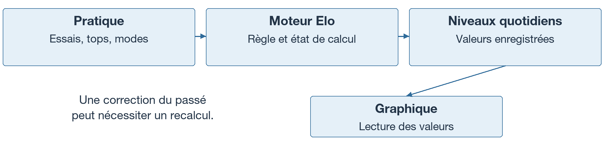

**Vérification dans la copie étudiante :** le graphique de progression lit les valeurs `ClimberLevelDaily` déjà enregistrées. Pour les jours intermédiaires, il prolonge la dernière valeur connue. Il ne recalcule pas l'Elo dans cette fonction. Le guide indique que les calculs ne sont pas lancés automatiquement au démarrage : une démo accessible ne garantit pas une courbe renseignée.

Les rapports relèvent par ailleurs une reprise incrémentale incomplète et une mauvaise prise en compte de certaines corrections ou suppressions. La refonte devra comparer le résultat d'une reprise avec celui d'un recalcul complet.

*Sources : notice, règles R08–R12 ; `core/utils/graph/progression.py`, fonction `progression_process_chart`, relue pour cette version ; guide local, section 12.*

## 8. Accompagner les grimpeurs et comprendre l'activité

Le staff dispose de fonctions pour observer les ouvertures, consulter de l'activité, accompagner des grimpeurs et gérer des compétitions. Le suivi repose notamment sur des salles autorisées par le grimpeur.

Quatre notions doivent rester séparées :

| Notion | Sens |
|---|---|
| Salle favorite | Préférence choisie par l'utilisateur |
| Salle voie ou bloc calculée | Affectation dérivée de la pratique selon une règle du POC |
| Salle autorisée | Salle avec laquelle le grimpeur partage sa pratique |
| Rôle professionnel | Droit d'agir comme membre du staff sur un périmètre |

Changer une préférence ne devrait pas attribuer un droit professionnel. Les documents signalent pourtant des usages de la favorite comme périmètre de permission et un calendrier staff qui ne revérifie pas le partage appliqué par la liste. Ce sont des défauts à corriger, pas des règles à transmettre comme fonctionnement souhaité.

La direction dispose d'indicateurs transversaux. La « fréquentation » documentée combine de l'activité enregistrée dans MCL sur une fenêtre de quatorze jours. Elle ne compte pas les entrées physiques de la salle. La rétention à un an constate une connexion suffisamment éloignée de l'inscription ; elle ne démontre pas une pratique régulière pendant un an.

La dernière connexion et la dernière salle connue ne constituent pas un historique complet. Un tableau de bord doit donc annoncer ce qu'il mesure et les informations qui lui manquent.

*Sources : notice, sections 2 et 5 « Staff » / « Direction », règle R24. Aucun parcours de capture préparé pour ces rôles.*

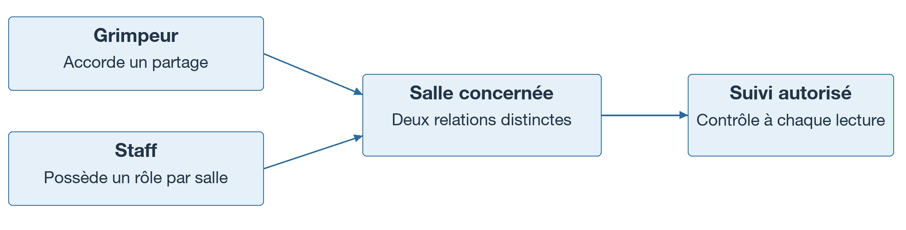

## 9. Comprendre les familles de compétition

Le POC contient trois familles dont les identités, les performances et les classements diffèrent.

| Famille | Participants et données | Principe de classement documenté |
|---|---|---|
| Contest permanent | Comptes MCL ; réussites issues du carnet et ouvertures actives | Classique ou 1 000 points, selon configuration |
| Contest ponctuel | Comptes MCL ; résultats propres au contest | Classique ou 1 000 points, avec départages selon le format |
| Event bloc | Participants propres à l'événement, réunis en duos | Points des tops, puis nombre de tops, puis zones |
| RouteEvent voie | Participants propres à l'événement, individuels | Prise atteinte et « + », rangs par voie puis moyenne géométrique |

Dans un Contest individuel classique, une ouverture réussie vaut un point. Dans le principe des 1 000 points, la valeur d'une ouverture se partage entre ses réussisseurs. Le règlement d'équipe emploie une formule différente : on ne peut pas lui appliquer mécaniquement le calcul individuel.

Pour Event, un top implique la zone lorsque le bloc en possède une. Pour RouteEvent, le « + » vaut 0,5 dans la comparaison des prises ; les ex æquo obtiennent le rang moyen des places occupées. Le classement global favorise la plus petite moyenne géométrique. Population, précision et traitement des absences doivent être explicités avant publication.

Les participants Event et RouteEvent ne sont pas des comptes Django. Leur lien personnel donne accès à leur périmètre, sous conditions de créneau et de paiement validé. Ce dernier état ne prouve pas l'existence d'un encaissement intégré. Une phase représente ici un créneau ; elle ne constitue pas automatiquement un tour sportif autonome.

**Alti Ligue** est une autre publication : un classement quotidien fondé sur les niveaux Elo, une condition d'activité et une affectation de salle. Il ne faut pas le confondre avec les résultats d'un événement.

Ces fonctions sont documentées dans le code, mais leur démonstration complète n'est pas préparée. Le document ne doit pas inviter l'étudiant à les tester comme un parcours garanti.

*Sources : notice, sections 5 et 7, règles R13–R22.*

## 10. Suivre les données, de leur origine à l'écran

Comprendre une information consiste aussi à savoir qui l'a produite. Le catalogue historique provient d'un CSV topo associé à l'écosystème Altissimo. L'import normalise notamment des cotations, couleurs, profils et styles. Dans la copie étudiante, les imports distants sont désactivés et les données de départ sont synthétiques.

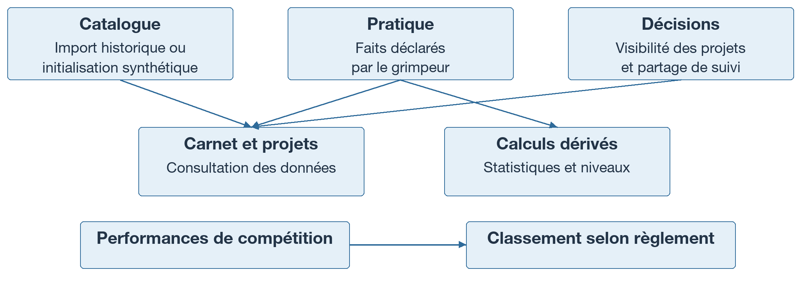

Trois catégories permettent de raisonner : les **faits déclarés**, comme les essais et leur date ; les **décisions**, comme masquer un projet ou autoriser un suivi ; les **dérivés**, comme le niveau ou un classement.

Un cache est une copie destinée à accélérer l'affichage. Il ne doit pas remplacer la source de vérité. Après modification d'une pratique, les résultats qui en dépendent peuvent nécessiter un recalcul ou une invalidation.

Les propriétés courantes d'une ouverture influencent certains calculs historiques. Modifier une cotation peut ainsi changer la lecture du passé. Pour la cible, il faudra décider si une correction s'applique rétroactivement et conserver la trace de cette décision.

Le contrat complet du flux externe reste à obtenir : stabilité des identifiants, exhaustivité, retrait d'une ouverture et traitement des erreurs. L'absence d'un identifiant dans un téléchargement incomplet ne suffit pas à prouver un démontage.

*Sources : notice, sections 6 et 13 ; recommandations, principes directeurs et imports ; assainissement.*

## 11. Se repérer dans les grandes briques du POC

MCL est un monolithe Django : plusieurs applications fonctionnelles composent un même serveur. Les pages sont principalement produites par des templates ; du JavaScript ajoute des interactions et des graphiques. PostgreSQL conserve les données.

| Briques actuelles | Responsabilité principale |
|---|---|
| `custom_auth` | Comptes, profils et salles |
| `core` | Ouvertures, pratique, carnet, projets et graphiques |
| `staff_admin` / `dir_admin` | Fonctions staff, niveaux et indicateurs direction |
| `contest`, `event`, `route_event` | Les familles de compétition |
| `public_contests` | Publications et Alti Ligue |
| `services`, `reset_password`, `catch_all` | Infrastructure web/PWA, récupération de compte et redirections |

Ce découpage aide à chercher dans le dépôt, mais ne dessine pas des frontières métier parfaites : la salle est placée avec l'authentification et le niveau dans l'application staff, alors qu'ils servent à plusieurs usages.

L'environnement étudiant suit cette chaîne :

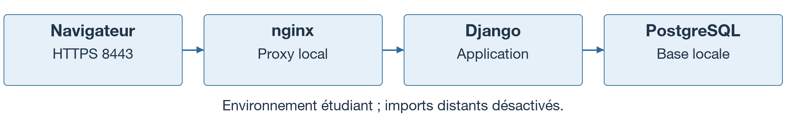

Une étape d'initialisation prépare le schéma et les données de démonstration. Les procédures historiques de démarrage ne remplacent pas ce dispositif. La copie a notamment exclu les anciennes migrations et utilise le mécanisme local décrit dans les notes d'assainissement ; ce n'est pas une stratégie de migration de production à reprendre telle quelle.

La PWA permet une expérience de web installé et des consultations en cache. Les fichiers examinés ne démontrent pas une synchronisation complète des écritures hors ligne. Un contenu visible depuis le cache ne prouve pas qu'une nouvelle saisie a été enregistrée sur le serveur.

*Sources : analyse technique, section 4 ; notice, section 8 ; guide local, section 13 ; assainissement.*

## 12. Ce qui doit survivre à une refonte

La première responsabilité d'une reprise est de préserver le sens des informations. Changer le modèle ou l'interface ne doit pas attribuer une pratique à une autre ouverture ni effacer silencieusement une décision du grimpeur.

| Élément à préserver | Contrôle concret à préparer |
|---|---|
| Ouvertures actives et inactives, identifiants sources | Retrouver la même ouverture et son carnet après migration |
| Essais, tops, modes, flash et dates disponibles | Comparer les valeurs par utilisateur et ouverture |
| Choix de visibilité et autorisations de suivi | Retrouver les décisions, sans inventer leur date d'origine |
| Particularités des salles et correspondances de cotations | Tester les capacités de pratique et les valeurs inconnues |
| Règlements et résultats publiés | Expliquer chaque écart après évolution d'une formule |
| Traductions, textes et contenus utiles | Vérifier disponibilité, droits et pertinence avant réutilisation |

Préserver ne signifie pas recopier les tables à l'identique. Une future séance peut avoir une identité propre tout en conservant les références de toutes les lignes sources. Un niveau peut être recalculé, à condition de garder une référence aux valeurs déjà publiées et de justifier les écarts.

On ne doit pas inventer une chronologie d'essais à partir de compteurs, fusionner un participant et un compte sur leur seul nom, ni reconstituer des anciennes cotations absentes des sources disponibles.

La démo étudiante ne contient pas les données historiques réelles ni les plans réels exclus lors de l'assainissement. Cette page définit des principes pour une future migration autorisée ; elle ne promet pas que ces éléments sont présents dans le livrable.

*Sources : notice, section 13 ; recommandations, section 10 ; assainissement.*

## 13. Ce qui doit être reconstruit

La proposition des rapports est un monolithe Django modulaire avec PostgreSQL, des règles métier indépendantes des écrans et une API commune aux clients qui en auront besoin. Ce choix reste une proposition de conception.

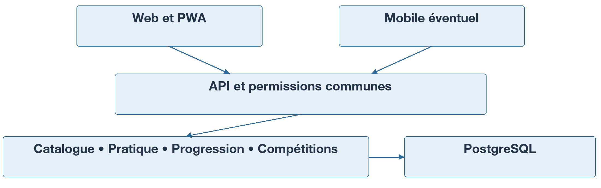

Les priorités se comprennent à partir de situations concrètes. Deux saisies simultanées ne doivent pas créer de doublon. Déplacer une séance sur une date occupée ne doit pas supprimer une autre pratique. Changer de favorite ne doit pas donner accès aux données d'une nouvelle salle. Corriger le passé doit déclencher les recalculs appropriés.

La cible devra donc disposer de séances identifiées, de contraintes sur les compteurs, de contrôles d'accès par objet et de règles partagées entre interface, exports et traitements. Les calculs de classement ne devraient pas dépendre de l'extraction d'un morceau de HTML.

Les imports devront valider un même instantané avant d'appliquer créations, modifications et retraits. Les calculs et opérations de maintenance devront être exécutés explicitement, indépendamment du lancement des serveurs web.

La première étape fonctionnelle proposée reste le parcours salle → topo → pratique → carnet. Les projets, la progression et les compétitions peuvent suivre selon des priorités validées. Une application native et une synchronisation hors ligne complète nécessitent un besoin confirmé ; leur présence dans une architecture cible ne les rend pas obligatoires pour la première livraison.

La reprise gagnera à transformer chaque ambiguïté en exemple attendu avant de choisir son implémentation.

*Sources : recommandations, sections 1 à 6 et 13.*

## 14. Apprendre en explorant et préparer la suite

Après le guide de démarrage, explorer la démo avec une question à la fois :

1. Ouvrir Démo Voie puis Démo Bloc. Identifier ce qui permet de reconnaître une ouverture et ce qui décrit sa difficulté.
2. Comparer liste et plan. Expliquer pourquoi un numéro d'emplacement ne suffit pas à identifier une ouverture dans le temps.
3. Lire une séance puis le carnet. Préciser l'unité de chaque écran : ligne, séance regroupée ou ouverture agrégée.
4. Enregistrer une pratique simple, puis la retrouver. Le guide local détaille la vérification de persistance après redémarrage.
5. Consulter les projets. Expliquer pourquoi réussite et objectif tête peuvent coexister, sans supposer que tous les cas sont déjà présents dans la base.
6. Décrire les informations nécessaires à un calcul de niveau. Ne pas attendre de ce parcours une exécution automatique des traitements Elo.

Avant de fixer les règles du nouveau produit, plusieurs décisions restent nécessaires : portée du flash entre modes, durée du masquage d'un projet, traitement des cotations inconnues, échantillon d'initialisation du niveau, périodes sportives, populations de classement et gestion des ex æquo.

Les usages réellement prioritaires, le contrat du catalogue externe, les volumes et l'état de la production ne sont pas établis par ce livrable. Les indiquer comme inconnus permet de poser les bonnes questions sans donner une apparence de certitude aux rapports.

### Références pour approfondir

- [Démarrage local](MCL_DEMARRAGE_LOCAL.md) : installation et exploration de la copie étudiante.
- [Notice de reprise](../reference/MCL_NOTICE_REPRISE.md) : vocabulaire, fonctionnement, registre R01–R24 et données à préserver.
- [Analyse technique](../reference/MCL_ANALYSE_TECHNIQUE.md) : architecture et repères dans le code historique.
- [Recommandations de refonte](../reference/MCL_RECOMMANDATIONS_REFONTE.md) : architecture proposée, migration et 28 scénarios de référence.
- [Assainissement](../ASSAINISSEMENT.md) : différences entre source historique et copie étudiante.
- [Validation de passation](../VALIDATION_PASSATION.md) : contrôles déjà réalisés, distincts de la présente rédaction.

Les captures présentent les données fictives du compte de démonstration. Le guide distingue les comportements du POC et les propositions de refonte ; les décisions métier encore ouvertes restent à valider.
